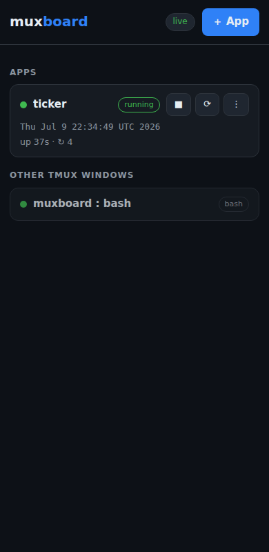
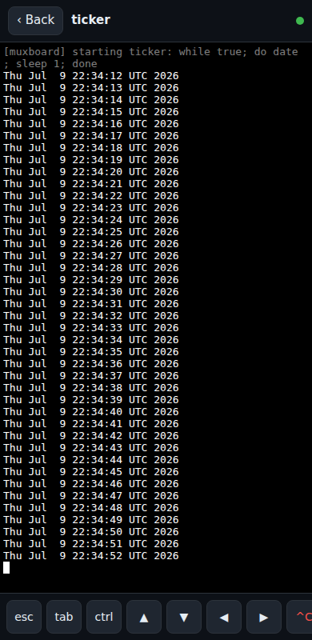

# muxboard

**pm2's dashboard with tmux's interactivity.** A single-binary web control panel for
everything running on your phone server (Termux + proot) or any Linux box: see what's
running, what crashed and why, restart with one tap, and type into a real live
terminal — from any browser, phone or PC.

<p>


</p>

## Why

If you run bots and scripts in tmux on an Android phone or a cheap VPS, you know the pain:

- tmux gives you **interactivity but no supervision** — a crashed window just vanishes,
  along with its last error output.
- pm2/systemd give you **supervision but no interactivity** — and don't work in a
  rootless proot userland anyway.

muxboard marries the two, and adds the one thing nothing else can tell you:
**"Android killed your apps at 03:12 — restart all?"**

## Features

- **App cards** — every managed program gets a card with live status, last output line,
  uptime, and restart count. Unmanaged tmux windows show up too, and are attachable.
- **Real crash detection** — apps run inside a tiny wrapper that records exit codes,
  keeps the pane alive after a crash (with the error still on screen), and snapshots
  the last 200 lines as a crash log.
- **Auto-restart** — per app: off / on-crash / always, with exponential backoff and a
  circuit breaker (5 crashes in 2 minutes → stop burning battery, badge red).
- **"Killed by OS" detection** — when Android's Doze massacres your processes, muxboard
  is the only tool that tells you, and offers one-tap "restart all".
- **Full interactive terminal** — xterm.js bridged to the real tmux pane, with a
  thumb-sized key bar (esc / tab / ctrl / arrows / ^C). No `Ctrl-b` needed, ever.
- **Plain tmux underneath** — kill muxboard and your apps keep running; `tmux attach`
  over SSH always works as a fallback.
- **Single static binary** — web UI embedded, state in two hand-editable JSON files,
  no database, no npm, no reverse proxy.

## Quick start

Needs `tmux` and `go` (until binary releases exist):

```sh
git clone https://github.com/Cyb0rgCode/proot muxboard && cd muxboard
go build -o muxboard . && ./muxboard serve
```

or:

```sh
curl -fsSL https://raw.githubusercontent.com/Cyb0rgCode/proot/main/install.sh | sh
muxboard serve
```

`muxboard serve` prints a tokened URL (and a QR code when listening beyond
localhost) — open it, you're in. Default bind is `127.0.0.1:8689`; use
`--listen 0.0.0.0:8689` for LAN access, or reach it through
[Tailscale](https://tailscale.com) / an SSH tunnel from anywhere.

### On Android (Termux + proot-distro)

muxboard runs *inside* your proot distro, next to your apps and tmux:

```sh
# Termux side (once): keep Android from killing everything
pkg install proot-distro termux-api
termux-wake-lock          # and exempt Termux from battery optimization

proot-distro login debian # then follow the quick start above
```

## How it works

```
browser (PWA: dashboard + xterm.js)
    │ websockets, bearer token
muxboard agent (Go, single binary)
    │ tmux new-window / send-keys / pipe-pane / capture-pane
tmux ── window per app ── `muxboard run` wrapper ── your program
```

The wrapper is the only writer of an app's runtime state file; the agent is the only
writer of `apps.json`. That split means no locks, no races, and supervision that
keeps working while the agent is dead. Full details in [DESIGN.md](DESIGN.md).

## Security model

The token printed on first run is the only credential — treat the URL as a secret.
muxboard binds to localhost by default and delegates "access from anywhere" to
Tailscale/SSH rather than reimplementing auth hardening. It is remote code execution
by design: never expose it to the open internet.

## Storage

| File | What | Who writes it |
|---|---|---|
| `~/.muxboard/apps.json` | app definitions | the agent (or you, over SSH) |
| `~/.muxboard/state/<id>.json` | runtime state | the `muxboard run` wrapper |
| `~/.muxboard/state/<id>.crash` | last words after a crash | the wrapper |
| `~/.muxboard/token` | web UI credential | generated on first run |

Backup = copy the directory.

## Roadmap (v2)

ntfy.sh crash notifications · CPU/RAM per app · scheduled jobs · adopt-running-window ·
prebuilt release binaries · multi-box view.

## License

MIT
